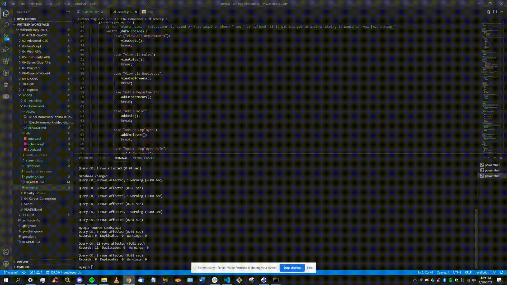
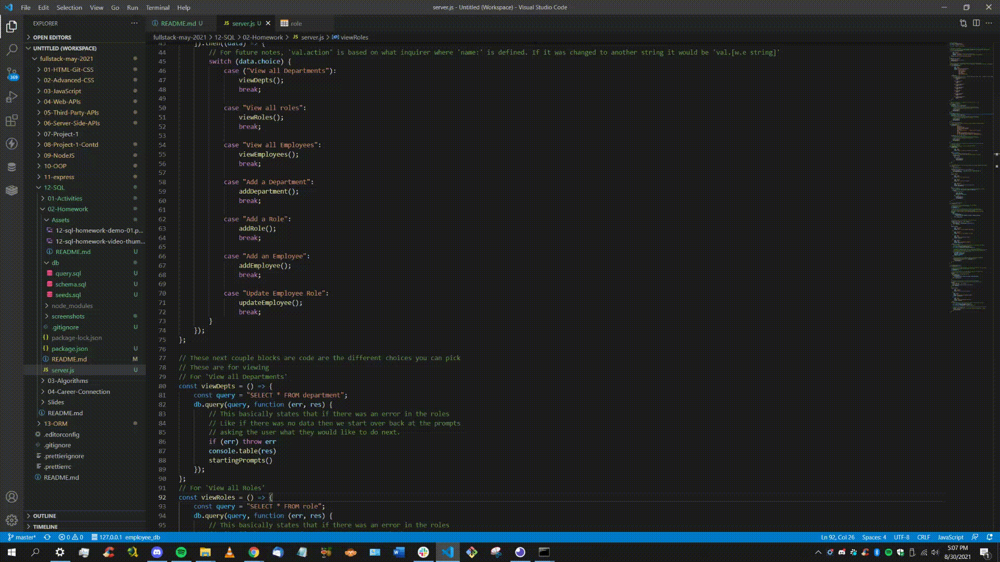
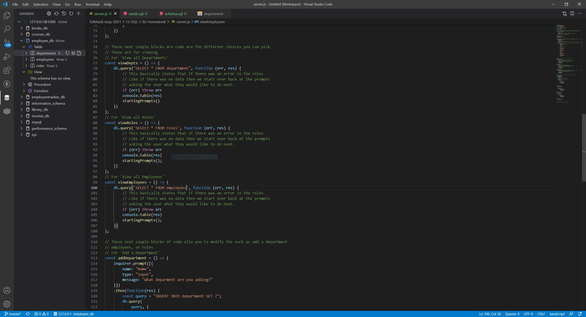
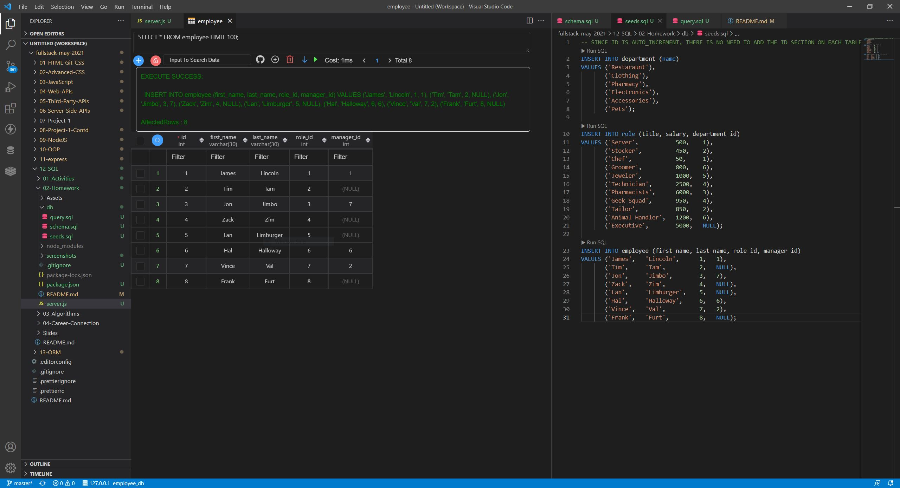

## Project Title: Employee Tracker

  ## Description:
  The Employee Tracker is an application that can help keep track of employees based on their role, the department where they work in and othe ways of tracking employees.

  ## Table of Contents
  * [Installation](#installation)
  * [Usage](#usage)
  * [Contributors](#contributors)
  * [License](#license)
  * [Tests](#tests)
  * [Questions](#questions)
  
  ## Installation
  -- What technologies did the application require in order to run smoothly and effectively?--

  The application uses a few technologies in the making of this application. The main bulk of the application is Javascript where most of the logic is programmed. Other technology used in this project include mysql to create the databases and the tables, Node.Js help visualize the application in VS code. A few npm packages like express, node, sql are needed to run this application smoothly.

  ## Usage
  -- What is the application used for? --

  The application is mostly used in a work environment. What kind of work environment is largely up to the company. This is mostly for business managers to keep track of employees and to help change roles and managers when needed.

  ## License
  -- Are there any license the application has? --

  This Application is covered by the MIT license.

  [License Information](https://opensource.org/licenses/MIT)

  

  ## Contributors
  -- Were there any contributors to the application/project --

  Contributors: Justin Liao

  ## Tests
  -- How can we test the application --

  To test the application you will need a couple of modules installed

  ## Questions
  -- Have any questions? --

  Please reach out to me if you have any questions. Contact me at: jyliao369@gmail.com

  -- Want to see the repo of the project --

  Interested in seeing other projects I have worked on? My repository can be accessed here: 
  https://github.com/jyliao369

  ## Demonstration
  -- Creating Database --
  
  

  -- All View Options --
  
  

  -- All Add Functions --
  
  

  -- Demonstration of the Update Employee --
  
  

  ## Screenshots
  -- Basic Code --
  

  
  -- Code For all Options --
  

  -- Generated Table --
  

  ## Live Links

  Github Repo: https://github.com/jyliao369/Employee-Tracker

  Deployed Link: N/A

  Heroku Live Link: N/A

  